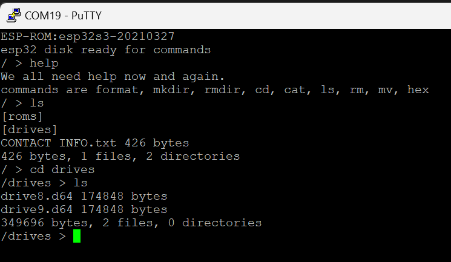

## File command processor for ESP32 ##

ESP32 can embed a file system in its own flash.  This utility built with Arduino 2.x IDE provides for comand line maintenance of the files, moving, renaming, viewing, or formatting all the storage using FATFS.  Note with a search/replace you can use LittleFS or SPIFFS instead.

This allows for file storage, retrieval and updates without requiring an SD card interface.

I recommend first using [esp32-asyncwebserver-fileupload-example](https://github.com/smford/esp32-asyncwebserver-fileupload-example), example 2 to upload the files to storage.  Note it defaults to SPIFFS but simple changes can change it to FATFS or LittleFS. 

